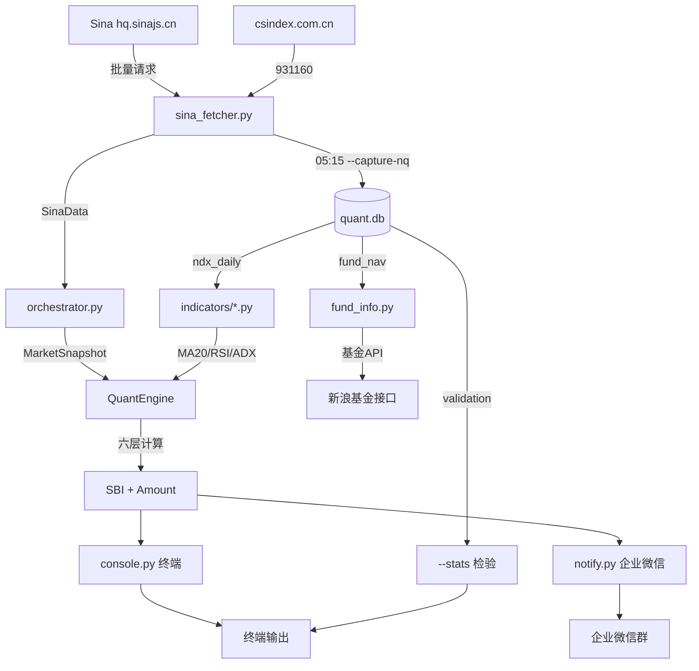

# 易方达全球成长精选 (012922) 量化定投 Agent

> 理念：不预测涨跌，只对"恐慌与贪婪"做数学反应。
> 六层滤网模型，每天 14:50 告诉你该投多少钱。

---
## ⚠️ 重要声明

本模型仅为个人量化研究工具，不构成任何投资建议。

- 所有输出结果（包括 SBI 分数、建议买入金额）仅代表模型基于历史数据的数学计算，不保证未来收益，也不代表市场真实走势。
- 使用者需自行承担所有投资风险。作者不对因使用本模型产生的任何直接或间接损失负责。
- 模型依赖的因子可能会失效，回测结果不代表实际业绩。投资前请务必独立判断，并咨询专业持牌机构。
- 本仓库公开的代码、数据和说明仅用于交流学习，严禁用于商业用途或向他人提供付费投资建议。

## 1. 项目结构

```
易方达/
├── README.md                        # 项目说明
├── LICENSE                          # 开源许可
├── config.example.yaml              # 配置模板
├── config.yaml                      # 运行时配置（已 gitignore）
├── run_scheduler.py                 # 定时调度器（05:15 + 14:50）
├── cpo_history_931160.json          # CPO 通信设备指数历史数据
├── ndx_history_raw.py               # 纳指 100 历史日线数据
├── nasdaq_clean.csv                 # 清洗后的纳斯达克数据
│
├── yfd_quant/                       # 核心代码包
│   ├── main.py                      # 主入口（所有命令行参数）
│   ├── config.py                    # 配置加载与校验
│   ├── types.py                     # 数据结构定义
│   ├── fund_info.py                 # 基金信息查询与持仓分析
│   ├── backtest.py                  # 回测引擎
│   │
│   ├── data/                        # 数据获取层
│   │   ├── sina_fetcher.py          #   新浪财经 API 批量抓取
│   │   ├── csindex_cpo.py           #   中证指数 CPO 数据
│   │   ├── orchestrator.py          #   数据编排与聚合
│   │   ├── db.py                    #   SQLite 数据库读写（含快照表）
│   │   └── date_utils.py            #   交易日历与日期工具
│   │
│   ├── indicators/                  # 技术指标计算
│   │   ├── calculator.py            #   指标总调度（含数据校验）
│   │   ├── ma.py                    #   移动均线（MA20/MA200）
│   │   ├── rsi.py                   #   RSI 相对强弱
│   │   ├── adx.py                   #   ADX 趋势强度
│   │   ├── atr.py                   #   ATR 波动率
│   │   └── price_extremes.py        #   52 周价格极值
│   │
│   ├── model/                       # 六层滤网模型
│   │   ├── engine.py                #   量化引擎（含输入校验）
│   │   ├── layer1_attraction.py     #   L1 单指标吸引力清洗
│   │   ├── layer2_base.py           #   L2 多因子底仓
│   │   ├── layer3_alpha.py          #   L3 Alpha 补偿（因子互斥）
│   │   ├── layer4_technical.py      #   L4 技术修正
│   │   ├── layer5_sbi.py            #   L5 SBI 汇聚
│   │   └── layer6_position.py       #   L6 仓位映射
│   │
│   ├── output/                      # 输出层
│   │   ├── console.py               #   终端 Rich 表格输出
│   │   ├── notify.py                #   企业微信 Webhook 推送
│   │   └── json_writer.py           #   JSON 结果持久化
│   │
│   └── tests/                       # 单元测试（18 个用例）
│       ├── test_model.py            #   模型计算测试
│       ├── test_layer1.py           #   L1 吸引力函数测试
│       └── test_date_utils.py       #   日期工具测试
│
├── output/                          # 运行输出（自动创建）
│   ├── quant.db                     #   SQLite 主数据库
│   ├── backtest_records.csv         #   回测每日记录
│   ├── backtest_chart.png           #   回测收益曲线
│   └── backtest_summary.md          #   回测指标摘要
```

---

## 2. 项目简介

本系统基于**六层滤网量化模型**，每日自动抓取 A 股光模块（CPO）、纳指期货（NQ）、纳指 100 现货（NDX）、VIX 恐慌指数、离岸人民币（USDCNH）的实时数据，经过六层数学计算输出**SBI 综合得分（0-100）**和**建议买入金额**。

**核心特点：**
- 跌得越深，买得越重；涨得越凶，一分不掏
- 所有因子互相独立，绝不对同一件坏事重复加分
- 永远保留底仓，对下午 3 点至美股开盘之间 6.5 小时的不可控风险保持敬畏
- 全自动数据抓取（新浪财经 API），无需任何付费数据源

---

## 3. 快速开始

### 3.1 环境要求

| 项目 | 要求 |
|------|------|
| 操作系统 | Windows / macOS / Linux |
| Python | 3.9+ |
| 网络 | 能访问 `hq.sinajs.cn`（国内网络即可） |

### 3.2 安装依赖

```bash
pip install pandas requests pyyaml rich pytest
```

### 3.3 配置

```bash
copy config.example.yaml config.yaml    # Windows
cp config.example.yaml config.yaml      # Mac/Linux
```

编辑 `config.yaml`：

```yaml
M: 20.0           # 单日最大申购额（元）
M_min: 0.0        # 每日强制底仓（元），0 表示可以不投
timezone_discount: 0.85  # 时区敬畏折扣
fund_code: "012922"      # 基金代码

notify:
  wecom_webhook: "https://qyapi.weixin.qq.com/cgi-bin/webhook/send?key=xxx"
```

### 3.4 导入历史数据

```bash
# 导入纳斯达克 100 日线历史（项目自带示例数据）
python -m yfd_quant.main --import-kline ndx_history_raw.py

# 导入 CPO 通信设备指数历史（项目自带示例数据）
python -m yfd_quant.main --import-cpo cpo_history_931160.json
```

### 3.5 全功能测试

```bash
python -m yfd_quant.main --test
```

5 项检查：依赖 → 配置 → Sina API → 数据库 → 单元测试。**只读不写**。

### 3.6 首次运行

```bash
python -m yfd_quant.main
```

看到 SBI 分数和建议金额即成功。

---

## 4. 架构说明：六层滤网

### 模块一：单指标吸引力清洗

$$f(x) = \begin{cases} 100, & x \le -2.5 \\ 50 - 20x, & -2.5 < x < 2.5 \\ 0, & x \ge 2.5 \end{cases}$$

把不同市场的涨跌幅统一映射为 0~100 的"便宜程度分数"。跌超 2.5% 满分，涨超 2.5% 零分。

### 模块二：多因子底仓

$$Base = 0.25 \cdot [f(R_{CPO}) \cdot \tau_{CPO}] + 0.65 \cdot f(R_{NQ}) + 0.10 \cdot f(R_{FX})$$

| 因子 | 权重 | 数据源 | 含义 |
|------|------|--------|------|
| R_CPO | 25% | 中证指数 931160 | 通信设备指数涨跌幅（csindex） |
| R_NQ | 65% | hf_NQ | 纳指 100 期货涨跌幅 |
| R_FX | 10% | fx_susdcnh | USDCNH 汇率涨跌幅 |

**τ_CPO**：当今日 CPO 点位 < 昨日 MA20 且 MA20 向下弯曲时，τ=0.8（主跌浪折扣），否则 τ=1.0。

### 模块三：聪明资金 Alpha 补偿（因子互斥区）

- **P_est** = C_{t-1} × (1 + R_NQ/100) — 预估今晚美股开盘价
- **Ω_EXT** — 血洗日奖励：中美双杀 +12，单杀 +5（与 Ω_BIAS、RSI_Bonus 互斥）
- **Ω_BIAS** — 单向乖离率：仅 BIAS ≤ -2.5% 时 8×|BIAS|奖励（只捡超卖，不追高）
- **Ω_POS** — 黄金坑：价格跌入 52 周底部 20% 区间时线性补偿 0~20 分
- **RSI_Bonus** — 衰竭奖励：RSI≤20 满 10 分（须 Ω_EXT=0 且 |BIAS|<2.5%）

### 模块四：技术修正

- **Ω_VOL** — ATR14 缺口风控：跳空 > 2×ATR14 打 7 折
- **τ_ADX** — 趋势过滤：强空头 0.6，年线下 0.8，正常 1.0
- **Φ(VIX)** — 恐慌乘数：0.6 + 1.6/(1+e^(-0.7×(VIX-14)))，范围 0.6~2.2

### 模块五：SBI 汇聚

$$SBI = \min(100,\ (Base + \Sigma\alpha) \cdot \Phi(VIX) \cdot \tau_{ADX} \cdot \Omega_{VOL})$$

### 模块六：仓位映射

$$Amount = \begin{cases} M_{min}, & SBI < 30 \\ M_{min} + \max(0, M \cdot (\frac{SBI-30}{70})^2 - M_{min}) \cdot 0.85, & SBI \ge 30 \end{cases}$$

---

## 5. 全部命令

### 5.1 模型运行

```bash
python -m yfd_quant.main                 # 标准运行（自动写入快照）
python -m yfd_quant.main --notify        # 运行 + 企业微信推送（优先用当日快照数据）
python -m yfd_quant.main --debug         # 打印全部中间值（优先用当日快照数据）
python -m yfd_quant.main -M 100 -m 20    # 自定义金额
python -m yfd_quant.main --test          # 全功能测试（只读）
```

> `--notify` 和 `--debug` 会优先使用当日快照数据（14:50 决策时刻冻结），确保测试通知时显示的是真实决策数据而非实时数据。

### 5.2 收盘数据抓取（每天 05:15）

```bash
python -m yfd_quant.main --capture-nq
```

一次抓取 5 个品种写入数据库，同时自动补录验证数据 + 抓取基金净值 + 推送企业微信。

### 5.3 数据导入

```bash
python -m yfd_quant.main --import-kline ndx_history_raw.py     # 纳指 100 历史
python -m yfd_quant.main --import-cpo cpo_history_931160.json  # CPO 通信设备指数历史
python -m yfd_quant.main --import-csv data.csv                 # 通用 CSV
```

### 5.4 基金信息查询

```bash
python -m yfd_quant.fund_info                          # 完整查询
python -m yfd_quant.fund_info --show-holdings          # 只看持仓+市场占比
python -m yfd_quant.fund_info --save-csv               # 保存 90 日净值 CSV
```

### 5.5 回测

```bash
python -m yfd_quant.backtest -M 20 --min 0             # 基础回测
python -m yfd_quant.backtest -M 20 --min 0 --save-to-db # 写入验证表
```

### 5.6 验证与补录

```bash
python -m yfd_quant.main --stats                       # 查看模型检验统计
python -m yfd_quant.main --backfill-all                # 批量补录所有缺失的实际数据
python -m yfd_quant.main --backfill-actual 日期,开盘,收盘  # 手动补录单日
python -m yfd_quant.main --recalc-snapshot 2026-05-12  # 重算快照表中的模型指标
python -m yfd_quant.main --update-nav 日期,净值,收益率  # 手动录入基金净值
```

> `--backfill-all` 从 ndx_daily 表自动补录 validation 中缺失的 p_est_deviation、entry_return、forward_return，同时从 fund_nav 表补录 fund_entry_return 和 fund_forward_return。定时任务失败时运行此命令即可。
>
> `--recalc-snapshot` 手动修改快照表中的输入字段后，运行此命令重算全部计算指标。
>
> **手动输入字段（6 个）：** `r_cpo`、`r_nq`、`r_fx`、`vix`、`ndx_close_prev`、`cpo_downtrend`
>
> **重算字段（30 个）：**
> - 核心输出：`sbi`、`amount`、`p_est`、`base`、`raw_score`
> - Alpha 补偿：`omega_ext`、`omega_bias`、`omega_pos`、`rsi_bonus`、`bias_pct`、`p_pos`
> - 技术修正：`phi`、`tau_adx`、`omega_vol`、`gap`、`strong_downtrend`
> - 技术指标：`rsi`、`adx`、`ma20`、`ma200`、`high_52w`、`low_52w`、`atr14`、`di_plus`、`di_minus`
> - 吸引力分解：`f_cpo`、`f_nq`、`f_fx`、`tau_cpo`
> - 元数据：`operate_time`

### 5.7 定时调度

```bash
python run_scheduler.py               # 内置调度器（05:15 + 14:50）
```

或 Windows 任务计划程序：

```powershell
schtasks /create /tn "YFD_CaptureNQ" /tr "cmd /c cd /d d:\项目\基金相关\易方达 && python -m yfd_quant.main --capture-nq" /sc DAILY /st 05:15
schtasks /create /tn "YFD_Main" /tr "cmd /c cd /d d:\项目\基金相关\易方达 && python -m yfd_quant.main --notify" /sc WEEKLY /d MON,TUE,WED,THU,FRI /st 14:50
```

---

## 6. 配置说明

```yaml
M: 20.0                     # 单日最大申购额
M_min: 0.0                  # 每日强制底仓
timezone_discount: 0.85      # 时区敬畏折扣（加仓部分打 85 折）
fund_code: "012922"          # 基金代码（用于自动获取净值）

weight_version: "v3.0"       # 权重版本号
# 当前权重: CPO 25% | NQ 65% | FX 10%

notify:
  wecom_webhook: ""          # 企业微信机器人 Webhook URL
```

---

## 7. 数据流图



---

## 8. 数据库说明

数据库文件：`output/quant.db`（SQLite，无需安装）。

### 8.1 表总览

| 表 | 用途 | 写入方式 |
|----|------|----------|
| ndx_daily | 纳指 100 日线 OHLCV | --capture-nq (05:15) |
| nq_daily | 纳指期货 OHLC + is_final | 14:50(is_final=0) / 05:15(is_final=1) |
| cpo_daily | 通信设备指数 OHLC + change/changePct | --capture-nq (05:15) + --import-cpo |
| vix_daily | VIX 期货 OHLC + is_final | 同上 |
| fx_daily | USDCNH 汇率 + is_final | 同上 |
| **snapshot** | **14:50 模型决策快照（冻结输入+输出）** | **14:50 自动写入，可用 --recalc-snapshot 重算** |
| validation | 模型检验（实际验证数据） | --backfill-all 从 snapshot + ndx_daily 补录 |
| fund_nav | 基金净值 | --capture-nq 自动获取 |

---

### 8.2 ndx_daily（纳指 100 日线）

| 字段 | 类型 | 说明 |
|------|------|------|
| date | TEXT PK | 交易日期，格式 YYYY-MM-DD |
| open | REAL | 开盘价 |
| high | REAL | 最高价 |
| low | REAL | 最低价 |
| close | REAL | 收盘价 |
| volume | INTEGER | 成交量 |
| operate_time | TEXT | 数据入库时间 |

数据来源：新浪财经 `gb_ndx` 接口，由 `--capture-nq` 在 05:15 写入。用于计算全部技术指标（MA20、MA200、RSI、ADX、ATR14、52周高低）。

---

### 8.3 nq_daily（纳指期货）

| 字段 | 类型 | 说明 |
|------|------|------|
| date | TEXT PK | 交易日期 |
| open | REAL | 开盘价 |
| high | REAL | 最高价 |
| low | REAL | 最低价 |
| close | REAL | 收盘价 |
| operate_time | TEXT | 数据入库时间 |
| is_final | INTEGER | 0=盘中临时数据(14:50)，1=收盘确认(05:15) |

数据来源：新浪财经 `hf_NQ` 接口。`R_NQ` 涨跌幅 = (当前close - 前日close) / 前日close × 100%，用于模块一吸引力分数和模块三 P_est 计算。

---

### 8.4 cpo_daily（通信设备指数）

| 字段 | 类型 | 说明 |
|------|------|------|
| date | TEXT PK | 交易日期 |
| open | REAL | 开盘价 |
| high | REAL | 最高价 |
| low | REAL | 最低价 |
| close | REAL | 收盘价 |
| change | REAL | 涨跌额 |
| change_pct | REAL | 涨跌幅 %（直接取自中证指数接口） |
| operate_time | TEXT | 数据入库时间 |

数据来源：中证指数 931160 接口。`R_CPO` 直接使用 `change_pct`，用于模块一吸引力分数。`τ_CPO`（主跌浪折扣）判断：close < MA20(昨日) 且 MA20 < MA20(5日前) → τ=0.8，否则 τ=1.0。

---

### 8.5 vix_daily（VIX 恐慌指数期货）

| 字段 | 类型 | 说明 |
|------|------|------|
| date | TEXT PK | 交易日期 |
| open | REAL | 开盘价 |
| high | REAL | 最高价 |
| low | REAL | 最低价 |
| close | REAL | 收盘价 |
| operate_time | TEXT | 数据入库时间 |
| is_final | INTEGER | 0=盘中，1=收盘确认 |

数据来源：新浪财经 `hf_VX` 接口。VIX 用于模块五恐慌乘数：Φ(VIX) = 0.6 + 1.6 / (1 + e^(-0.7 × (VIX - 14)))，范围 0.6~2.2。

---

### 8.6 fx_daily（USDCNH 离岸人民币）

| 字段 | 类型 | 说明 |
|------|------|------|
| date | TEXT PK | 交易日期 |
| close | REAL | 收盘价 |
| operate_time | TEXT | 数据入库时间 |
| is_final | INTEGER | 0=盘中，1=收盘确认 |

数据来源：新浪财经 `fx_susdcnh` 接口。`R_FX` = (当日close - 前日close) / 前日close × 100%，用于模块一吸引力分数。美元跌 → 人民币升值 → 吸引力高。

---

### 8.7 snapshot（14:50 模型决策快照）

每次 14:50 运行时冻结全部输入+输出，后续 `--notify`、`--debug`、`--stats` 均从此表读取。可用 `--recalc-snapshot` 重算。

**输入字段（手动填写，6 个）：**

| 字段 | 类型 | 说明 | 来源 |
|------|------|------|------|
| r_cpo | REAL | A股光模块涨跌幅 % | cpo_daily.change_pct |
| r_nq | REAL | 纳指期货涨跌幅 % | (nq当前 - nq昨收) / nq昨收 × 100 |
| r_fx | REAL | USDCNH 汇率涨跌幅 % | (fx当日 - fx昨收) / fx昨收 × 100 |
| vix | REAL | VIX 恐慌指数 | vix_daily.close |
| ndx_close_prev | REAL | 纳指 100 昨收 | ndx_daily 前一日 close |
| cpo_downtrend | INTEGER | CPO 主跌浪（0/1） | close < MA20 且 MA20 < MA20(5日前) |

**计算字段（模型输出，30 个）：**

| 字段 | 类型 | 模块 | 计算公式 |
|------|------|------|----------|
| f_cpo | REAL | L1 | f(r_cpo) = max(0, min(100, 50 - 20×r_cpo)) |
| f_nq | REAL | L1 | f(r_nq) 同上 |
| f_fx | REAL | L1 | f(r_fx) 同上 |
| tau_cpo | REAL | L2 | cpo_downtrend=1 → 0.8，否则 1.0 |
| base | REAL | L2 | 0.25×f_cpo×tau_cpo + 0.65×f_nq + 0.10×f_fx |
| p_est | REAL | L3 | ndx_close_prev × (1 + r_nq/100) |
| omega_ext | REAL | L3 | 中美双杀(r_cpo≤-5 且 r_nq≤-5)→12，单杀→5，否则→0 |
| bias_pct | REAL | L3 | (p_est - ma20) / ma20 × 100% |
| omega_bias | REAL | L3 | omega_ext=0 且 bias_pct≤-2.5% → 8×|bias_pct|，否则→0 |
| p_pos | REAL | L3 | (p_est - low_52w) / (high_52w - low_52w) × 100%，clamp[0,100] |
| omega_pos | REAL | L3 | p_pos≤20% → 20×(1 - p_pos/20)，否则→0 |
| rsi_bonus | REAL | L3 | omega_ext=0 且 |bias_pct|<2.5% 时：RSI≤20→10，20<RSI<30→30-RSI，否则→0 |
| ma20 | REAL | 指标 | 20 日简单移动平均线（截止昨日） |
| ma200 | REAL | 指标 | 200 日简单移动平均线（截止昨日） |
| high_52w | REAL | 指标 | 252 日最高价（约 52 周） |
| low_52w | REAL | 指标 | 252 日最低价（约 52 周） |
| atr14 | REAL | 指标 | 14 日真实波幅均值（Wilder's 平滑） |
| rsi | REAL | 指标 | 14 日相对强弱指标（Wilder's 平滑） |
| adx | REAL | 指标 | 14 日趋向平均值（Wilder's 平滑） |
| di_plus | REAL | 指标 | 正向趋向指标 +DI |
| di_minus | REAL | 指标 | 负向趋向指标 -DI |
| omega_vol | REAL | L4 | |p_est - ndx_close_prev| > 2×atr14 → 0.7，否则→1.0 |
| tau_adx | REAL | L4 | adx>25 且 di_minus>di_plus → 0.6；adx≤25 且 p_est<ma200 → 0.8；否则→1.0 |
| phi | REAL | L4 | 0.6 + 1.6 / (1 + e^(-0.7×(vix-14)))，范围 0.6~2.2 |
| gap | REAL | L4 | |p_est - ndx_close_prev|（跳空缺口点数） |
| strong_downtrend | INTEGER | L4 | adx>25 且 di_minus>di_plus → 1，否则→0 |
| raw_score | REAL | L5 | (base + omega_ext + omega_bias + omega_pos + rsi_bonus) × phi × tau_adx × omega_vol |
| sbi | REAL | L5 | min(100, raw_score) |
| M | REAL | 配置 | 单日最大申购额（元） |
| M_min | REAL | 配置 | 每日强制底仓（元） |
| amount | REAL | L6 | sbi<30 → M_min；sbi≥30 → M_min + max(0, M×((sbi-30)/70)^2 - M_min) × 0.85 |
| operate_time | TEXT | 元数据 | 数据入库时间 |

**技术指标计算说明：**
- **MA20/MA200**：简单移动平均线，取最近 N 个交易日收盘价的算术平均
- **RSI(14)**：Wilder's 平滑，RSI = 100 - 100/(1 + AG/AL)，AG=14日平均涨幅，AL=14日平均跌幅
- **ATR(14)**：True Range = max(high-low, |high-prev_close|, |low-prev_close|)，取 14 日 Wilder's 平滑均值
- **ADX(14)**：由 +DI 和 -DI 计算 DX = |+DI - -DI|/(+DI + -DI) × 100，再对 DX 做 14 日 Wilder's 平滑
- **52周高低**：最近 252 个交易日的最高价和最低价

---

### 8.8 validation（模型检验）

| 字段 | 类型 | 说明 | 计算 |
|------|------|------|------|
| date | TEXT PK | 交易日期 | — |
| sbi | REAL | 当日 SBI 分数 | 回测写入（旧数据） |
| amount | REAL | 当日建议金额 | 回测写入（旧数据） |
| r_cpo | REAL | 当日 CPO 涨跌幅 | 回测写入（旧数据） |
| r_nq | REAL | 当日 NQ 涨跌幅 | 回测写入（旧数据） |
| r_fx | REAL | 当日 FX 涨跌幅 | 回测写入（旧数据） |
| vix | REAL | 当日 VIX | 回测写入（旧数据） |
| c_prev | REAL | 纳指昨收 | 回测写入（旧数据） |
| p_est | REAL | 预估开盘价 | 回测写入（旧数据） |
| base | REAL | 模块二底仓分数 | 回测写入（旧数据） |
| omega_ext | REAL | 血洗日奖励 | 回测写入（旧数据） |
| omega_bias | REAL | 乖离率补偿 | 回测写入（旧数据） |
| omega_pos | REAL | 黄金坑补偿 | 回测写入（旧数据） |
| rsi_bonus | REAL | RSI 衰竭奖励 | 回测写入（旧数据） |
| phi | REAL | VIX 恐慌乘数 | 回测写入（旧数据） |
| tau_adx | REAL | 趋势过滤系数 | 回测写入（旧数据） |
| omega_vol | REAL | 波动风控系数 | 回测写入（旧数据） |
| bias_pct | REAL | 乖离率 % | 回测写入（旧数据） |
| rsi | REAL | RSI 值 | 回测写入（旧数据） |
| adx | REAL | ADX 值 | 回测写入（旧数据） |
| ndx_actual_open | REAL | 纳指实际开盘价 | --backfill-all 从 ndx_daily 补录 |
| ndx_actual_close | REAL | 纳指实际收盘价 | --backfill-all 从 ndx_daily 补录 |
| p_est_deviation | REAL | 预估偏差 % | (actual_open - p_est) / p_est × 100 |
| entry_return | REAL | NDX 入场日涨跌 % | (actual_close - c_prev) / c_prev × 100 |
| forward_return | REAL | NDX 买入后次日涨跌 % | (次日close - actual_close) / actual_close × 100 |
| fund_entry_return | REAL | 基金入场日涨跌 % | (nav[T] - nav[T-1]) / nav[T-1] × 100，T+1 可用 |
| fund_forward_return | REAL | 基金买入后涨跌 % | (nav[T+1] - nav[T]) / nav[T] × 100，T+2 可用（周五→下周一） |
| operate_time | TEXT | 数据入库时间 | — |

> 注：sbi~adx 共 18 个字段为旧版回测数据。新流程的模型数据全部存在 snapshot 表中。validation 表只存实际验证数据（ndx_actual_open/close 及 5 个计算指标：NDX 涨跌幅 2 个 + 基金涨跌幅 2 个 + p_est 偏差 1 个）。
>
> 基金收益有 T+1 延迟：`fund_entry_return` 在 T+1 的 05:15 自动补录（此时 fund_nav 已有 T 日净值），`fund_forward_return` 在 T+2 补录。周五的 forward_return 要到下周一才有数据。

---

### 8.9 fund_nav（基金净值）

| 字段 | 类型 | 说明 |
|------|------|------|
| date | TEXT PK | 净值日期 |
| nav | REAL | 单位净值 |
| daily_return | REAL | 日收益率（小数，如 -0.0123 表示 -1.23%） |
| operate_time | TEXT | 数据入库时间 |

数据来源：新浪基金接口，由 `--capture-nq` 自动获取。用于回测中将 SBI 建议金额转换为实际份额和收益率。

---

## 9. 数据质量与容错策略

**核心原则：涉及资金决策，数据不够直接报错，绝不降级运行。**

| 检查点 | 触发条件 | 处理方式 |
|--------|----------|----------|
| NDX 历史行数 | < 200 行 | 拒绝运行，提示导入数据 |
| 指标列缺失 | 缺 open/high/low/close | 拒绝运行，提示检查数据 |
| NDX 数据含 NaN | 任何指标列为 NaN | 拒绝运行，提示数据损坏 |
| NDX 昨收 = 0 | ndx_close_prev <= 0 | 拒绝运行，提示接口异常 |
| VIX = 0 或 > 100 | 接口返回异常值 | 拒绝运行，提示检查 Sina |
| NQ/FX/VIX 关键字段为 0 | Sina 部分数据缺失 | 拒绝运行，不接受零值跑模型 |
| p_pos 越界 | < 0 或 > 100 | 自动 clamp 到 [0, 100] |
| M < M_min | 配置错误 | 拒绝运行，提示修改配置 |
| ADX 除零 | tr_s = 0 | np.where 防护，返回 0 |
| 基金净值年份翻转 | MM-DD 月份 > 当前月份 | 自动回退到上一年 |

---

## 10. 回测与分析

```bash
python -m yfd_quant.backtest -M 20 --min 0 --save-to-db
```

### 输出文件

| 文件 | 内容 |
|------|------|
| output/backtest_records.csv | 每日 SBI、金额、份额、收益率 |
| output/backtest_chart.png | 累计收益曲线 vs NDX 基准 |
| output/backtest_summary.md | 收益率、夏普比率、最大回撤、胜率 |

### 关键指标解读

| 指标 | 含义 | 参考标准 |
|------|------|----------|
| Sharpe Ratio | 风险调整后收益 | >1 良好，>2 优秀 |
| Max Drawdown | 最大回撤 | <20% 可接受 |
| Win Rate | 交易胜率 | >50% |
| Profit Factor | 盈亏比 | >1.5 良好 |

### 前视偏差杜绝

回测严格保证：T 日的模型输入只能使用 T-1 及之前的数据。涨跌幅从历史表按日期索引精确计算。

---

## 11. 季度维护指南

1. **检查持仓权重**：运行 `python -m yfd_quant.fund_info --show-holdings` 查看最新持仓分布，与模型权重对比
2. **更新 config.yaml**：若持仓偏离较大，调整 `layer2_base.py` 中的 W_CPO/W_NQ/W_FX，同步更新 `config.yaml` 中 `weight_version`
3. **验证数据源**：运行 `python -m yfd_quant.main --test` 确认所有接口正常
4. **季度回测**：运行 `python -m yfd_quant.backtest -M 20 --min 0 --save-to-db` 更新验证数据

---

## 12. 常见问题

**Q: Sina 数据获取失败？**
检查网络能否访问 `hq.sinajs.cn`。国内网络通常正常，VPN 可能干扰。

**Q: 周末运行模型显示什么？**
显示"周末模式"，使用周五收盘数据展示，不写入数据库。

**Q: NQ 昨收缺失？**
运行 `python -m yfd_quant.main --capture-nq` 补录。

**Q: 终端中文乱码？**
Windows 终端 GBK 编码问题，不影响计算。可重定向输出：`python -m yfd_quant.main > result.txt`

**Q: 配置文件 API Key 泄露？**
`config.yaml` 已在 `.gitignore` 中，不会被提交。

**Q: 如何确认模型计算正确？**
```bash
python -m yfd_quant.main --debug   # 打印全部中间值
python -m pytest yfd_quant/tests/  # 运行 18 个单元测试
```

---

## 13. 贡献与许可

本项目基于易方达全球成长精选（012922）量化实战模型构建。
权重版本：v3.0（CPO 25% / NQ 65% / FX 10%）
