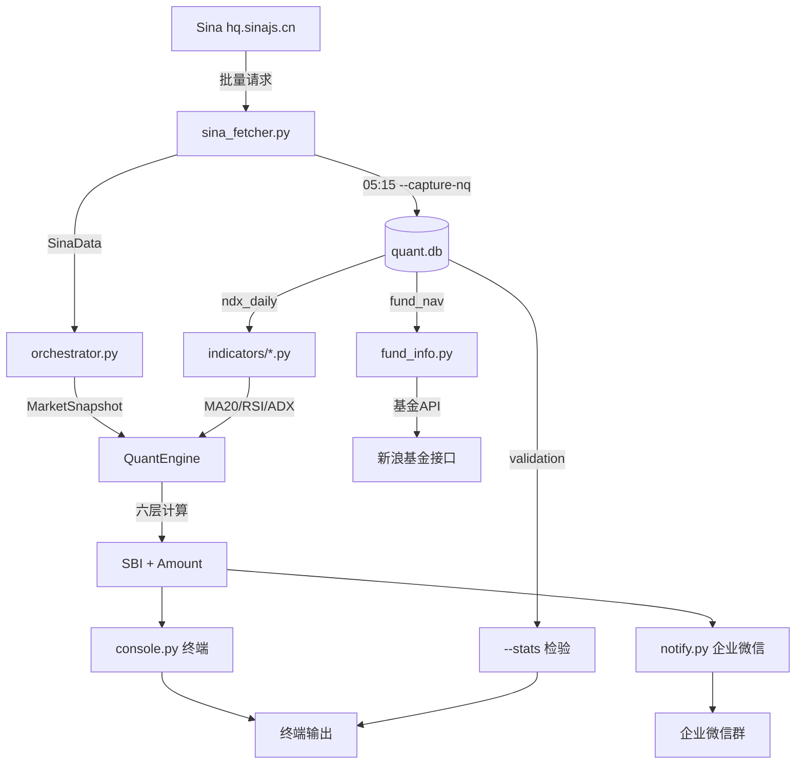

# 易方达全球成长精选 (012922) 量化定投 Agent

> 理念：不预测涨跌，只对"恐慌与贪婪"做数学反应。
> 六层滤网模型，每天 14:50 告诉你该投多少钱。

---
## ⚠️ 重要声明

本模型仅为个人量化研究工具，不构成任何投资建议。

- 所有输出结果（包括 SBI 分数、建议买入金额）仅代表模型基于历史数据的数学计算，不保证未来收益，也不代表市场真实走势。
- 使用者需自行承担所有投资风险。作者不对因使用本模型产生的任何直接或间接损失负责。
- 模型依赖的因子可能会失效，回测结果不代表实际业绩。投资前请务必独立判断，并咨询专业持牌机构。
- 本仓库公开的代码、数据和说明仅用于交流学习，严禁用于商业用途或向他人提供付费投资建议。

## 1. 项目简介

本系统基于**六层滤网量化模型**，每日自动抓取 A 股光模块（CPO）、纳指期货（NQ）、纳指 100 现货（NDX）、VIX 恐慌指数、离岸人民币（USDCNH）的实时数据，经过六层数学计算输出**SBI 综合得分（0-100）**和**建议买入金额**。

**核心特点：**
- 跌得越深，买得越重；涨得越凶，一分不掏
- 所有因子互相独立，绝不对同一件坏事重复加分
- 永远保留底仓，对下午 3 点至美股开盘之间 6.5 小时的不可控风险保持敬畏
- 全自动数据抓取（新浪财经 API），无需任何付费数据源

---

## 2. 快速开始

### 2.1 环境要求

| 项目 | 要求 |
|------|------|
| 操作系统 | Windows / macOS / Linux |
| Python | 3.9+ |
| 网络 | 能访问 `hq.sinajs.cn`（国内网络即可） |

### 2.2 安装依赖

```bash
pip install pandas requests pyyaml rich pytest
```

### 2.3 配置

```bash
copy config.example.yaml config.yaml    # Windows
cp config.example.yaml config.yaml      # Mac/Linux
```

编辑 `config.yaml`：

```yaml
M: 20.0           # 单日最大申购额（元）
M_min: 0.0        # 每日强制底仓（元），0 表示可以不投
timezone_discount: 0.85  # 时区敬畏折扣
fund_code: "012922"      # 基金代码

notify:
  wecom_webhook: "https://qyapi.weixin.qq.com/cgi-bin/webhook/send?key=xxx"
```

### 2.4 导入历史数据

```bash
# 导入纳斯达克 100 日线历史（项目自带示例数据）
python -m yfd_quant.main --import-kline ndx_history_raw.py
```

### 2.5 全功能测试

```bash
python -m yfd_quant.main --test
```

5 项检查：依赖 → 配置 → Sina API → 数据库 → 单元测试。**只读不写**。

### 2.6 首次运行

```bash
python -m yfd_quant.main
```

看到 SBI 分数和建议金额即成功。

---

## 3. 架构说明：六层滤网

### 模块一：单指标吸引力清洗

$$f(x) = \begin{cases} 100, & x \le -2.5 \\ 50 - 20x, & -2.5 < x < 2.5 \\ 0, & x \ge 2.5 \end{cases}$$

把不同市场的涨跌幅统一映射为 0~100 的"便宜程度分数"。跌超 2.5% 满分，涨超 2.5% 零分。

### 模块二：多因子底仓

$$Base = 0.25 \cdot [f(R_{CPO}) \cdot \tau_{CPO}] + 0.65 \cdot f(R_{NQ}) + 0.10 \cdot f(R_{FX})$$

| 因子 | 权重 | 数据源 | 含义 |
|------|------|--------|------|
| R_CPO | 25% | gn0701159 | A股光模块概念板块涨跌幅 |
| R_NQ | 65% | hf_NQ | 纳指 100 期货涨跌幅 |
| R_FX | 10% | fx_susdcnh | USDCNH 汇率涨跌幅 |

**τ_CPO**：当今日 CPO 点位 < 昨日 MA20 且 MA20 向下弯曲时，τ=0.8（主跌浪折扣），否则 τ=1.0。

### 模块三：聪明资金 Alpha 补偿（因子互斥区）

- **P_est** = C_{t-1} × (1 + R_NQ/100) — 预估今晚美股开盘价
- **Ω_EXT** — 血洗日奖励：中美双杀 +12，单杀 +5（与 Ω_BIAS、RSI_Bonus 互斥）
- **Ω_BIAS** — 单向乖离率：仅 BIAS ≤ -2.5% 时 8×|BIAS|奖励（只捡超卖，不追高）
- **Ω_POS** — 黄金坑：价格跌入 52 周底部 20% 区间时线性补偿 0~20 分
- **RSI_Bonus** — 衰竭奖励：RSI≤20 满 10 分（须 Ω_EXT=0 且 |BIAS|<2.5%）

### 模块四：技术修正

- **Ω_VOL** — ATR14 缺口风控：跳空 > 2×ATR14 打 7 折
- **τ_ADX** — 趋势过滤：强空头 0.6，年线下 0.8，正常 1.0
- **Φ(VIX)** — 恐慌乘数：0.6 + 1.6/(1+e^(-0.7×(VIX-14)))，范围 0.6~2.2

### 模块五：SBI 汇聚

$$SBI = \min(100,\ (Base + \Sigma\alpha) \cdot \Phi(VIX) \cdot \tau_{ADX} \cdot \Omega_{VOL})$$

### 模块六：仓位映射

$$Amount = \begin{cases} M_{min}, & SBI < 30 \\ M_{min} + \max(0, M \cdot (\frac{SBI-30}{70})^2 - M_{min}) \cdot 0.85, & SBI \ge 30 \end{cases}$$

---

## 4. 全部命令

### 4.1 模型运行

```bash
python -m yfd_quant.main                 # 标准运行
python -m yfd_quant.main --notify        # 运行 + 企业微信推送
python -m yfd_quant.main --debug         # 打印全部中间值
python -m yfd_quant.main -M 100 -m 20    # 自定义金额
python -m yfd_quant.main --test          # 全功能测试（只读）
```

### 4.2 收盘数据抓取（每天 05:15）

```bash
python -m yfd_quant.main --capture-nq
```

一次抓取 5 个品种写入数据库，同时自动补录验证数据 + 抓取基金净值 + 推送企业微信。

### 4.3 数据导入

```bash
python -m yfd_quant.main --import-kline ndx_history_raw.py
python -m yfd_quant.main --import-csv data.csv
```

### 4.4 基金信息查询

```bash
python -m yfd_quant.fund_info                          # 完整查询
python -m yfd_quant.fund_info --show-holdings          # 只看持仓+市场占比
python -m yfd_quant.fund_info --save-csv               # 保存 90 日净值 CSV
```

### 4.5 回测

```bash
python -m yfd_quant.backtest -M 20 --min 0             # 基础回测
python -m yfd_quant.backtest -M 20 --min 0 --save-to-db # 写入验证表
```

### 4.6 验证统计

```bash
python -m yfd_quant.main --stats                       # 查看模型检验
python -m yfd_quant.main --update-nav 日期,净值,收益率  # 手动录入基金净值
```

### 4.7 定时调度

```bash
python run_scheduler.py               # 内置调度器（05:15 + 14:50）
```

或 Windows 任务计划程序：

```powershell
schtasks /create /tn "YFD_CaptureNQ" /tr "cmd /c cd /d d:\项目\基金相关\易方达 && python -m yfd_quant.main --capture-nq" /sc DAILY /st 05:15
schtasks /create /tn "YFD_Main" /tr "cmd /c cd /d d:\项目\基金相关\易方达 && python -m yfd_quant.main --notify" /sc WEEKLY /d MON,TUE,WED,THU,FRI /st 14:50
```

---

## 5. 配置说明

```yaml
M: 20.0                     # 单日最大申购额
M_min: 0.0                  # 每日强制底仓
timezone_discount: 0.85      # 时区敬畏折扣（加仓部分打 85 折）
fund_code: "012922"          # 基金代码（用于自动获取净值）

weight_version: "v3.0"       # 权重版本号
# 当前权重: CPO 25% | NQ 65% | FX 10%

notify:
  wecom_webhook: ""          # 企业微信机器人 Webhook URL
```

---

## 6. 数据流图



---

## 7. 数据库说明

数据库文件：`output/quant.db`（SQLite，无需安装）。

| 表 | 用途 | 写入方式 |
|----|------|----------|
| ndx_daily | 纳指 100 日线 OHLCV | --capture-nq (05:15) |
| nq_daily | 纳指期货 OHLC + is_final | 14:50(is_final=0) / 05:15(is_final=1) |
| cpo_daily | A 股光模块 OHLCV | --capture-nq (05:15) |
| vix_daily | VIX 期货 OHLC + is_final | 同上 |
| fx_daily | USDCNH 汇率 + is_final | 同上 |
| validation | 模型检验记录 | 14:50 自动写入，05:15 补录实际数据 |
| fund_nav | 基金净值 | --capture-nq 自动获取 |

---

## 8. 回测与分析

### 运行回测

```bash
python -m yfd_quant.backtest -M 20 --min 0 --save-to-db
```

### 输出文件

| 文件 | 内容 |
|------|------|
| output/backtest_records.csv | 每日 SBI、金额、份额、收益率 |
| output/backtest_chart.png | 累计收益曲线 vs NDX 基准 |
| output/backtest_summary.md | 收益率、夏普比率、最大回撤、胜率 |

### 关键指标解读

| 指标 | 含义 | 参考标准 |
|------|------|----------|
| Sharpe Ratio | 风险调整后收益 | >1 良好，>2 优秀 |
| Max Drawdown | 最大回撤 | <20% 可接受 |
| Win Rate | 交易胜率 | >50% |
| Profit Factor | 盈亏比 | >1.5 良好 |

### 前视偏差杜绝

回测严格保证：T 日的模型输入只能使用 T-1 及之前的数据。涨跌幅从历史表按日期索引精确计算。

---

## 9. 季度维护指南

1. **检查持仓权重**：运行 `python -m yfd_quant.fund_info --show-holdings` 查看最新持仓分布，与模型权重对比
2. **更新 config.yaml**：若持仓偏离较大，调整 `layer2_base.py` 中的 W_CPO/W_NQ/W_FX，同步更新 `config.yaml` 中 `weight_version`
3. **验证数据源**：运行 `python -m yfd_quant.main --test` 确认所有接口正常
4. **季度回测**：运行 `python -m yfd_quant.backtest -M 20 --min 0 --save-to-db` 更新验证数据

---

## 10. 常见问题

**Q: Sina 数据获取失败？**
检查网络能否访问 `hq.sinajs.cn`。国内网络通常正常，VPN 可能干扰。

**Q: 周末运行模型显示什么？**
显示"周末模式"，使用周五收盘数据展示，不写入数据库。

**Q: NQ 昨收缺失？**
运行 `python -m yfd_quant.main --capture-nq` 补录。

**Q: 终端中文乱码？**
Windows 终端 GBK 编码问题，不影响计算。可重定向输出：`python -m yfd_quant.main > result.txt`

**Q: 配置文件 API Key 泄露？**
`config.yaml` 已在 `.gitignore` 中，不会被提交。

**Q: 如何确认模型计算正确？**
```bash
python -m yfd_quant.main --debug   # 打印全部中间值
python -m pytest yfd_quant/tests/  # 运行 18 个单元测试
```

---

## 11. 贡献与许可

本项目基于易方达全球成长精选（012922）量化实战模型构建。
权重版本：v3.0（CPO 25% / NQ 65% / FX 10%）
